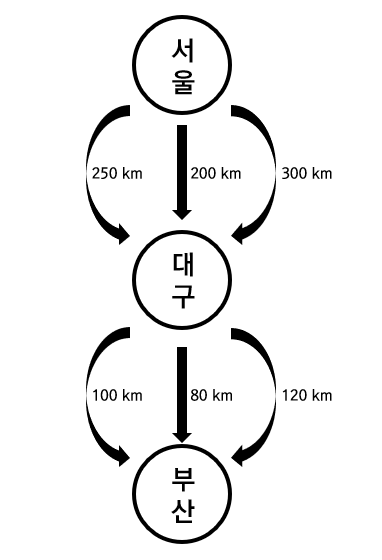

# Dynamic Programming
> 문제를 각각의 작은 문제로 나누어 해결한 결과를 저장해뒀다가 나중에 큰 문제의 결과와 합하여 풀이하는 알고리즘

---

## 1. 소개
* 라치드 벨만 Richard Bellman 이 고안한 알고리즘
  * 최단 거리를 구하는 벨만-포드 Bellman Ford 알고리즘, 차원의 저주 Curse of Dimensionality 이론을 만듦

* 최적 부분 구조 (Optimal Substructure) 의 문제를 풀이할 수 있음
  * 문제의 최적 해결 방법 = __부분 문제에 대한 최적 해결 방법__ 으로 구성되는 문제


알고리즘 | 풀이 가능한 문제들의 특징 | 풀이 가능한 문제, 알고리즘
--- | --- | ---
DP | <ul><li>최적 부분 구조 (Optimal Substructure)</li> <li>중복된 하위 문제들 (Overlapping Subproblems)</li></ul> | <ul><li>0-1 배낭 문제</li> <li>피보나치 수열</li> <li>다익스트라 알고리즘</li></ul>
Greedy | <ul><li>최적 부분 구조 (Optimal Substructure)</li> <li>탐욕 선택 속성 (Greedy Choice Property)</li></ul> | <ul><li>분할 가능 배낭 문제</li> <li>다익스트라 알고리즘</li> 
Divide&Conquer | <ul><li>최적 부분 구조 (Optimal Substructure)</li> | <ul><li>병합 정렬</li> <li>퀵 정렬</li> 

* 그리디 알고리즘
  * 그 순간에 최적이라고 생각되는 것을 선택하면서 풀이함

* 다이나믹 프로그래밍
  * __중복된 하위 문제들 (Overlapping Subproblem)__ 의 결과를 저장해뒀다가 풀이함

* 분할 정복 알고리즘
  * 중복되지 않은 하위 문제들에 대하여 풀이함

* __다익스트라 알고리즘__
  * BFS로 항상 최단 경로를 찾고 탐욕 선택 속성을 갖는 그리디 알고리즘
  * 이미 계산한 경로는 저장해두고 활용하여 중복된 하위 문제들을 푸는 다이나믹 알고리즘
  * __최적 부분 구조, 중복된 하위 문제들, 탐욕 선택 속성__ 모두 포함

---

## 2. 최적 부분 구조 (Optimal Substructure)
<p align="center">
  
</p>

__[서울 -> 부산 최단거리 경로]__ = __[ 서울 -> 대구 최단 경로 ]__ + __[ 대구 -> 부산 최단 경로 ]__
* 최적 부분 구조의 예시
  * 부분 문제에 대한 최적 해결 방법!
  * 분할 정복으로 풀이할 수 있고, DP, Greedy 알고리즘이 접근 후보가 될 수 있음
* 하지만, __[서울 -> 부산 고속도로]__ 한번에 가는 고속도로가 생긴다면, 더 이상 최적 부분 구조 문제가 아님
  * 분할 정복, DP, Greedy로 풀 수 없음

---

## 3. 중복된 하위 문제들
* DP로 접근할 수 있는 문제의 특징
  * (e.g.) 피보나치 수열

---

## 4. 다이나믹 프로그래밍 방법론
### (4.1) 패러다임
* __[중복된 하위 문제들]__ and __[최적 부분 구조]__ => __분할 정복__

### (4.2) 방법론
* __[하향식 접근법 : Memorization]__ or __[상향식 접근법 : Tabulation]__

* __상향식 Bottom-Up__
  * 작은 문제의 정답을 이용해 큰 문제의 정답을 풀어나감
  * 타뷸레이션 Tabulation
    * 데이터를 테이블 형태로 만들면서(Tabulate) 문제를 풀이함

```python
def fib(n):
    dp[0] = 0
    dp[1] = 1

    for i in range(2, n + 1):
        dp[i] = dp[i - 1] + dp[i - 2]
    return dp[n]
```

* __하향식 Top-Down__
  * 하위 문제에 대한 정답을 계산했는지 확인해가며 재귀로 문제를 품
  * 메모리제이션 Memorization
    * 재귀 풀이 + 이미 푼 정답을 재활용하는 효율적인 방식

```python
def fib(n):
    if n <= 1:
        return n
    
    if dp[n]:   # 이미 푼 문제의 정답을 재활용함
        return dp[n]

    dp[n] = fib(n - 1) + fib(n - 2)
    return dp[n]
```

---
## Reference
1. 파이썬 알고리즘 인터뷰 (저자 : 박상길) DP 편