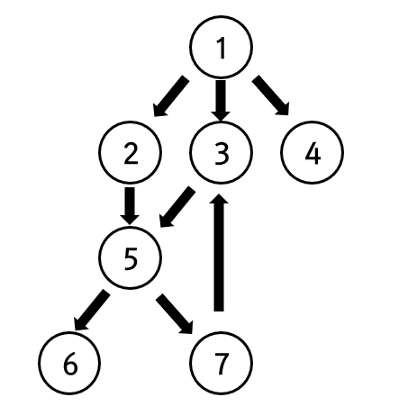

# Graph

## 1. 오일러 경로
### (1.1) 오일러 정리
```
모든 정점이 짝수 개의 차수(Degree)를 갖는다면 모든 다리를 한 번씩만 건너서 도달하는 것이 성립한다.
```
(1.2) 오일러 경로
```
모든 간선을 한 번씩 방문하는 유한 그래프 (Finite Graph)
```
* 간선을 기준으로 함.

---

## 2. 해밀턴 경로
### (2.1) 해밀턴 경로
```
각 정점을 한 번씩 방문하는 무향, 유향 그래프 경로
```
* 정점을 기준으로 함.
* 최적 알고리즘이 없는 NP-Complete 문제임.

### (2.2) 해밀턴 순환 (Hamiltonian Cycle)
* 원래의 출발점으로 돌아오는 경로
* (e.g.) 외판원 문제 (Travelling Salesman Problem)
  * 최단 거리의 해밀턴 순환을 찾는 문제
  * 각 도시를 방문하고 돌아오는 가장 짧은 경로를 찾기
  * Dynamic Programming 기법을 활용하여 최적화 가능함 -> _O(n<sup>2</sup> 2<sup>n</sup>)_

---
## 3. 그래프 순회 (Graph Traversals)
> 그래프 탐색 Search, 그래프의 각 정점을 방문하는 과정
> DFS, BFS   

<p align="center">
  
</p>

* 그래프를 표현하는 방법
  * 인접 행렬 (Adjacency Matrix)
  * 인접 리스트 (Adjacency List)
```python
# 인접 리스트로 구현
graph = {
    1: [2, 3, 4],
    2: [5],
    3: [5],
    4: [],
    5: [6, 7],
    6 : [],
    7 : [3]
}
```
### (3.1) DFS (Depth-First Search)
* 스택, 재귀로 구현함
* 백트래킹에서 효율적으로 사용됨

1. **재귀**를 이용한 DFS
```python
def recursive_dfs(node, visited=[]):
    visited.append(node)
    for v in graph[node]:
        if not v in visited:
            visited = recursive_dfs(v, visited)
    return visited
```

2. **스택**을 이용한 DFS
```python
def iterative_dfs(start_v):
    visited = []
    stack = [start_v]
    while stack:
        v = stack.pop()
        if v not in visited:
            visited.append(v)
            for node in graph[v]:
                stack.append(node)
    return visited
```

```python
# 직접 다시 구현해본 코드
from typing import List
def dfs(graph, start_v) -> List[int]:
    visited = []
    stack = list([start_v])
    while stack:
        node = stack.pop()
        if node not in visited:
            visited.append(node)
            stack.extend(graph[node][::-1])
    return visited
dfs(graph, 1)
```

### (3.2) BFS (Breadth-First Search)
* 큐로 구현함
* 그래프의 최단 경로 문제에 사용됨
  * (e.g.) 다익스트라 알고리즘

1. **큐**를 이용한 반복구조로 구현
```python
def iterative_bfs(start_v):
    visited = [start_v]
    queue = [start_v]
    while queue:
        v = queue.pop(0)
        for node in graph(v):
            if node not in visited:
                visited.append(node)
                queue.append(node)
    return visited
```
* 최적화를 위해 deque를 이용하여 구현 가능함
* <U>*BFS는 재쉬로 동작하지 않음*</U>

2. **Deque**을 이용한 최적화 구현
```python
# 직접 구현해본 코드
from typing import List
from collections import deque
def bfs(graph, start_v) -> List[int]:
    visited = []
    queue = deque([start_v])
    while queue:
        node = queue.popleft()
        if node not in visited:
            visited.append(node)
            queue.extend(graph[node])
    return visited
bfs(graph, 1)
```

## 4. 백트래킹
> 해결책에 대한 후보를 구축해 나아가다 가능성이 없다고 판단되면 즉시 후보를 포기(backtrank)해 정답을 찾아나가는 범용적인 알고리즘
>> 제약 충족 문제 (Constraint Satisfaction Problem)에 유용함
* 재귀로 구현됨
* 기본적으로 DFS 범주에 속함
* 트리의 가지치기 Pruning
  * DFS로 탐색을 시도하고, 가능성이 없는 후보를 포기하고 백트래킹 -> 탐색 최적화

## 5. 제약 충족 문제
> 수많은 제약 조건 (Constraints)을 충족하는 상태 (States)를 찾아내는 수학 문제
* 스도쿠 문제
* 퍼즐문제, 배낭 문제, 문자열 파싱, 조합 최적화
  * 십자말 풀이, 8퀸 문제, 4색 문제
  
---
## Reference
1. 파이썬 알고리즘 인터뷰 (저자 : 박상길) Graph 편
