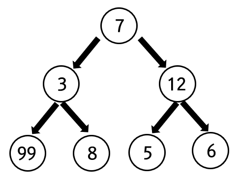

# Greedy Algorithm
> 글로벌 최적을 찾기 위해 각 단계에서 로컬 최적의 선택을 하는 휴리스틱 문제 해결 알고리즘

---
## 1. 소개
* 최적해를 보장하지는 못하지만, 주어진 시간 내에 최적에 가까운 답을 찾을 수 있음
* 그리디 문제의 특징
  * __탐욕 선택 속성 Greedy Choice Property__
    * 앞의 선택이 이후 선택에 영향을 주지 않는 것

  * __최적 부분 구조 Optimal Substructure__
    * 문제의 최적 해결 방법 = __부분 문제에 대한 최적 해결 방법__ 으로 구성되는 경우
* 예시
  * 다익스트라 알고리즘

  * 허프란 코딩 Huffman Coding
    * 압축 알고리즘
    * 허프만 트리를 만들 때 그리디 알고리즘 사용
    * 최적해 보장됨
    
  * 의사결정 트리 Decision Tree
    * ID3 알고리즘
    * 항상 최선을 답을 찾아서 트리를 만듦
    * 반드시 최적해를 찾는 것은 아님

---

## 2. 배낭 문제
* 조합 최적화 (Combinatorial Optimization) 문제

* __가치__ 와 __무게__ 가 있는 짐들을 배낭에 넣을 때 __가치의 합이 최대__ 가 되도록 하는 문제


그리디 알고리즘 | 다이나믹 프로그래밍
--- | ---
분할 가능 배낭 문제 (Fractional Knapsack Problem) | 0-1 배낭 문제
짐을 쪼갤 수 있는 경우 | 짐을 쪼갤 수 없는 경우
<br>

### (2.1) 분할 가능 배낭 문제

```python

# cargo : (value, weight)
cargo = [
    (4, 12),
    (2, 1),
    (10, 4),
    (1, 1),
    (2, 2)
]

def fractional_knapsack(cargo):
    capacity = 15
    pack = []

    # 단가 계산 역순 정렬
    for c in cargo:
        pack.append((c[0] / c[1], c[0], c[1]))  # (무게별 단가, value, weight)
    pack.sort(reverse=True)

    # 단가 순 그리디 계산
    total_value: float = 0
    for p in pack:
        # 물건을 다 담을 수 있는 경우
        if capacity - p[2] >= 0:
            capacity -= p[2]
            total_value += p[1]

        # 물건을 다 담을 수 없는 경우
        else:
            fraction = capacity / p[2]
            total_value += p[1] * fraction
            break

    return total_value
```
---

## 3. 동전 바꾸기 문제 (Coin-Change Problem)
* 동전의 액면이, 이전 액면의 배수 이상이 되면 (10 -> 50 -> 100) 그리디 알고리즘으로 해결 가능함
   * (e.g.) 동전 : 80원 짜리 동전이 있는 경우
     * 160원을 거슬러줄 때, 80원 짜리 동전을 2개 줘야 하지만, 그리디 알고리즘에서는 100원을 먼저 선택해버림  
     __-> 이런 경우, 다이나믹 프로그래밍으로 풀이해야 함__

---

## 4. 가장 큰 합
<p align="center">
  
</p>

* ___그리디 알고리즘의 실패 사례___
  * 그리디 알고리즘으로는 99를 발견할 수 없음
  * 이진 트리를 정렬하는 등 추가 작업이 필요함

---
## Reference
1. 파이썬 알고리즘 인터뷰 (저자 : 박상길) Greedy 편