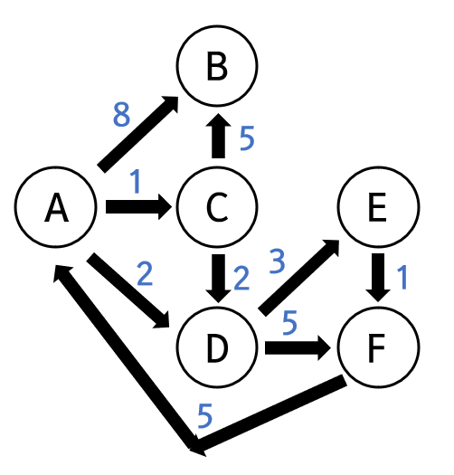

# Shortest Path 최단 경로 문제
> 각 간선의 가중치 합이 최소가 되는 두 정점 사이의 경로를 찾는 문제

## 1. 다익스트라 알고리즘
### (1.1) 개요
* 유명한 최단 경로 알고리즘
* BFS를 이용함.
* 임의의 정점을 출발 집합에 더할 때, 그 정점까지의 최단거리는 계산이 끝났다는 확신을 가짐.
* 음수 가중치를 갖는 그래프, 최장거리를 구할때는 사용할 수 없음
  * 음수 가중치 : 현재 정점 이후에 더 짧은 경로가 존재하는 경우
  * (cf.) 벨만-포드 Bellman-Ford 알고리즘
    * 음수 가중치를 계산할 수 있는 알고리즘  

### (1.2) 시간 복잡도
* 최초 구현은 O(V<sup>2</sup>) 이었으나, BFS에서 가장 가까운 순서를 찾을 때 우선순위 큐를 적용하여 O((V+E)logV), 모든 정점이 출발지에서 도달이 가능하다면 O(ElogV)가 됨.

### (1.3) 구현
<p align="center">
     
</p>

_Reference : [image url](https://www.fun-coding.org/Chapter20-shortest-live.html)_

```python
graph = {
    'A' : {'B' : 8, 'C' : 1, 'D' : 2},
    'B' : {},
    'C' : {'B' : 5, 'D' : 2},
    'D' : {'E' : 3, 'F' : 5},
    'E' : {'F' : 1},
    'F' : {'A' : 5}
}
```

```python
import heapq
def dijkstra(graph, start_v):
    Q = []
    # insert the inf value for all nodes in graph
    shortest_path = {node:float('inf') for node in graph}
    
    # set the distance of start_v node to 0  
    shortest_path[start_v] = 0

    # push [distance, start_v node] into heap
    heapq.heappush(Q, [shortest_path[start_v], start_v]) # heap <- [distance, node]

    while Q:
        # pop the node with the shortest distance
        current_distance, current_node = heapq.heappop(Q)

        # if current distance is larger than the stored shortest distance,
        # continue
        if current_distance > shortest_path[current_node]:
            continue
        
        # Navigate adjacent nodes and update shortest path
        for adjacent_node, weight in graph[current_node].items():
            new_distance = weight + current_distance

            if new_distance < shortest_path[adjacent_node]:
                shortest_path[adjacent_node] = new_distance
                heapq.heappush(Q, [new_distance, adjacent_node])

    return shortest_path
```
```python
dijkstra(graph, 'A')
# result -> {'A': 0, 'B': 6, 'C': 1, 'D': 2, 'E': 5, 'F': 6}
```
##  Reference
1. 파이썬 알고리즘 인터뷰 (저자 : 박상길) Shortest Path 편
2. https://www.fun-coding.org/Chapter20-shortest-live.html