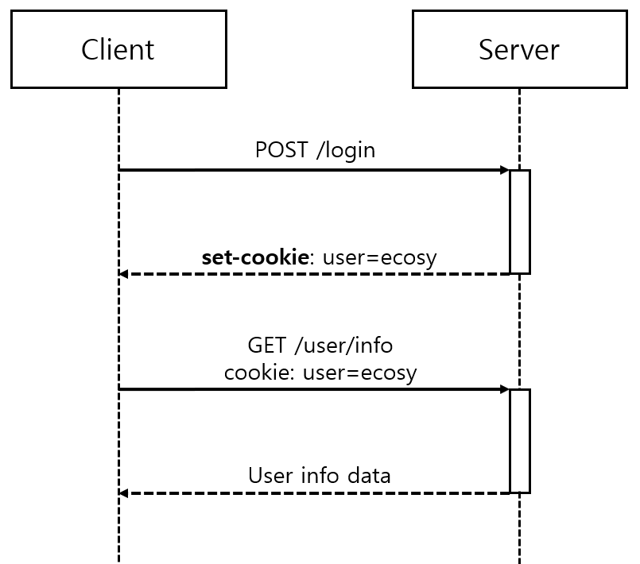
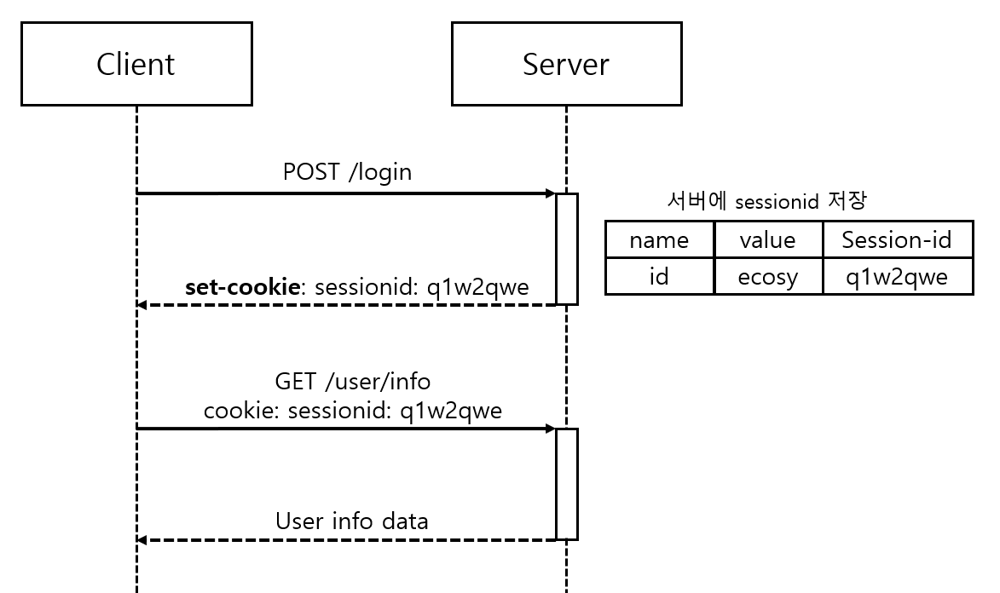

# Cookie and Session
## 1. HTTP 프로토콜의 특징
__1. Connectionless (비연결지향)__   
* Client -> Server로 Request를 보내고, Server -> Client로 요청에 맞는 Response를 보내면 바로 연결을 끊는다.   

__2. Stateless (상태 정보 유지 안함)__
* HTTP 통신은 요청을 응답하고 접속을 끊기 때문에, Client의 상태 정보를 유지하지 않는다.

_-> 로그인 하고 그 상태를 유지한 채로 웹 서비스를 제공하기 위해 <strong>Cookie, Session</strong>이라는 방법이 존재함_

---
## 2. Cookie
### 2.1 개념
    * 쿠키는 클라이언트 로컬에 저장되는 `key-value` 쌍의 데이터 파일
    * 이름, 값, 유효 시간, 경로 등 포함
    * Client 상태 정보를 브라우저에 저장하여 참조한다.
### 2.2 구성 요소
    * Name (쿠키의 이름)
    * Value (쿠키의 값)
    * Expires (쿠키 만료 시간)
    * Domain (쿠키를 전송할 도메인 이름)
    * Path (쿠키 전송 경로)
    * Secure (보안 연결 여부)
    * HttpOnly (HttpOnly 여부)

### 2.3 동작 방식

  

1. Client가 Server에 로그인 요청을 보낸다.

2. Server는 Client의 로그인 요청의 유효성을 확인하고 (id, pwd 검사), `Request Header`에 `set-cookie: user=ecosy` 를 추가하여 응답한다.

3. Client는 이후 Server에 요청할 때 전달받은 `cookie: user=ecosy` 쿠키를 자동으로 `Request Header`에 추가하여 요청한다. 헤더에 쿠키 값을 자동으로 추가하는데, 이는 브라우저에서 처리해주는 작업이다.   
쿠키의 기한이 정해져 있지 않고 명시적으로 지우지 않는다면 반 영구적으로 쿠키가 남아있게 된다.

* 쿠키 사용 예시
    * 아이디, 비밀번호 저장
    * 쇼핑몰 장바구니

### 2.4 쿠키 값 확인방법
* `브라우저의 쿠키관리 탭`, `쿠키관리 플러그인`을 설치하면 쿠키를 쉽게 수정할 수 있다. 쿠키는 Client에서 수정할 수 있기 때문에 위변조 위험이 항상 존재하여, 쿠키 value를 암호화해야 안전하다.

---
## 3. Session
### 3.1 개념
    * 일정 시간 동안 같은 브라우저로부터 들어오는 요청을 하나의 상태로 보고 그 상태를 유지하는 기술
    * 웹 브라우저를 통해 서버에 접속한 이후, 브라우저를 종료할 때까지 유지되는 상태

### 3.2 동작 방식

  

1. 웹 브라우저 -> Server에 로그인 요청을 한다.
2. Server는 해당 웹 브라우저(Client)의 로그인 요청의 유효성을 확인하고 (id, pwd 검사), unique한 id를 sessionid라는 이름으로 부여하고 저장한다.
3. Server가 응답할 때 `Response Header`에 `set-cookie: sessionid:q1w2qwe`를 추가하여 응답한다.
4. 웹 브라우저(Client)는 이후 Server에 요청할 때 전달받은 `sessionid:q1w2qwe`쿠키를 자동으로 `Request Header`에 추가하여 요청한다.
5. Server는 request header의 `sessionid` 값을 저장된 세션 저장소에서 찾아보고 유효한지 확인 후 요청을 처리하고 응답한다.

* Session 사용 예시
    * 로그인
---
## 4. Cookie vs Session
### 4.1 저장위치
* Cookie -> 로컬(Client)
* Session -> 서버

### 4.2 보안
* Cookie는 탈취, 변조가 가능하지만, Session은 ID 값만 갖고 있고 서버에도 저장되어 있기 때문에 상대적으로 안전하다.

### 4.3 LifeCycle
* Cookie는 브라우저를 종료해도 파일로 남아있지만, Session은 브라우저 종료시 삭제된다.

### 4.4 속도
* Cookie는 파일에서 읽기 때문에 상대적으로 빠르고, Session은 요청마다 서버에서 처리하기 때문에 비교적 느리다.

## Reference
1. https://doooyeon.github.io/2018/09/10/cookie-and-session.html
2. https://chrisjune-13837.medium.com/web-%EC%BF%A0%ED%82%A4-%EC%84%B8%EC%85%98%EC%9D%B4%EB%9E%80-aa6bcb327582